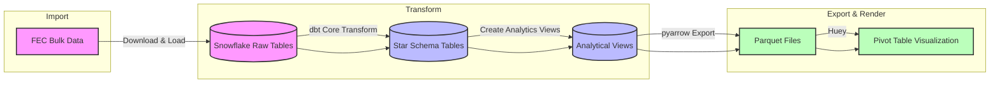

## FEC Compiled Campaign Contributions

**[Live Demo](https://smckissock.github.io/fec/)**

- Python scripts (in /import) to move [FEC data](https://www.fec.gov/data/browse-data/?tab=bulk-data) to tables in Snowflake. Largest table has individual contributions since 2000. 261 million records.  
- Dbt Core (in /transform) to setup reference data, populate a star schema, and make views for analysis
- pyarrow (in /export) to export views as Parquet files for use on web site
- [Huey](https://github.com/rpbouman/huey) (in /web) to present contribution data as pivot tables
- TODO: Add bar charts and sankey diagrams to analyse money flows by race, state, committee, etc

##### Note: this is a work in progress, so do not take the data as definitive. Instead refer to [FEC](https://www.fec.gov/) or [OpenSecrets](https://www.opensecrets.org/) 

---

### Data Pipeline

---

