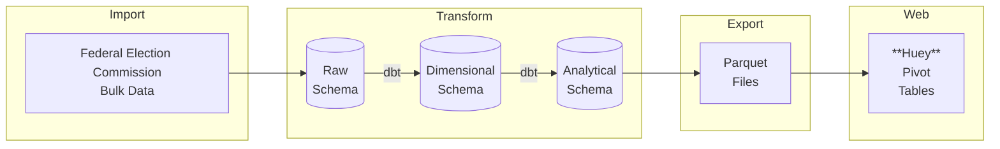

# FEC Campaign Contributions 2000-2025

Campaign finance data from the Federal Election Commission covering Presidential, Senate, and House candidates from 2000 to 2026. Pivot tables to analyze political contributions.
### [Live Demo](https://smckissock.github.io/fec/)

- Python scripts (in import) to move [FEC data](https://www.fec.gov/data/browse-data/?tab=bulk-data) to tables in Snowflake. Largest table has individual contributions since 2000. 261 million records.  
- Dbt Core (in transform) to setup reference data, populate a star schema, and make views for analysis
- pyarrow (in export) to export views as Parquet files for use on web site
- [Huey](https://github.com/rpbouman/huey) (in web) to present contribution data as pivot tables
- TODO: Add bar charts and sankey diagrams to analyse money flows by race, state, committee, etc

##### Note: this is a work in progress, so do not take the data as definitive. Instead refer to [FEC](https://www.fec.gov/) or [OpenSecrets](https://www.opensecrets.org/) 
---
### Data Pipeline

---

### Import
- Setup database, initial tables, and environment variables with this [sql script](./import/setup_db.sql)
- The tables match the source data, with additions of timestamps, source filenames, and source row numbers. Another column for the 2 year election cycle is also added because it is required by the build dimensional tables.

| Heading from [FEC Website](https://www.fec.gov/data/browse-data/?tab=bulk-data) | Snowflake Table | Description | Records (2000-2026) |
|:---|:------|:------------|---:|
| Candidate master | raw.candidate | Candidates registered for a race with FEC or states | 83,561 |
| Committee master | raw.committee | PACs, party committees, or candidate committees registered with the FEC | 200,457 |
| Candidate-committee linkages | raw.candidate_committee | Information about a candidate's primary committee | 80,423 |
| Contributions by individuals | raw.individual_contribution | Contributions from an individual to a committee | 261,190,046 |
| Contributions from committees to candidates and independent expenditures | raw.committee_contribution | Contributions from a committee to a candidate | 5,652,502 |

### Transform

#### Raw Schema

- 5 tables imported from FEC by [pythons scripts](./import)
- About a dozen csvs based on codes for different fields - state, office, party, etc. Imported via dbt seed mechanism, but with an added integer primary key. Csv files are [here](https://github.com/smckissock/fec/tree/main/transform/seeds)

#### Dimensional Schema

- Reference (seed) tables from raw schema are added with "dim_" prefix, an integer primary key, and NOT NULL and uniqueness tests on every field.
- Raw data for dimensions (e.g. candiate or committee) are type 2 slowly changing dimensions in the raw data. Each election cycle has a new record for each candidate/office, with the same cand_id as the prior cycle, but with a potentially different fields - maybe a new treasurer, etc. This structure works as is, so rows are copied 1-1. An integer primary key is added, and FEC codes are replaced foriegn keys to reference (seed) tables.
- Fact tables (fact_committee_contribution and fact_individual_contribution) are also added 1-1 from the raw data, with integer foriegn keys also replacing codes. Foriegn keys to dimension tables are found by matching the record from the same election cycle: cand_id (or cmte_ id) + source_file_year.   

#### Analysis Schema
- For now, just star joins on fact tables to bring back a subset of the data for each datamart.
- INNER JOINS on dimension tables, with COUNT tests to confirm joins are setup correctly   
---

### Export

Analysis views are exported to Parquet using pyarrow. Saved in data directory and served from github pages.

---

### Web

Parquet files and predined reports loaded into [Huey](https://github.com/rpbouman/huey). Huey is typically run as a stand alonw web app, with data (json, csv, parquet) provided by the user. Here, I embed it in a static website together with a way to load predined pivot tables based on the generated parquet files.     

### Limitations / Future Work
- Contributions from individuals to committees and committees to candidates have an	"Amendment indicator." Need more information in order to handle these correctly. 
- FEC website has data for transfer between committees, but this is not included.
- FEC also has data for committee operating expenses - salaries, advertising, travel, etc - that is not included.
- There doesn't appear to be a way to track a person across camapigns for different offices - e.g. Barack Obama has different cand_ids for House, Senate and presidential runs, but under slightly different names.
- Similar problems tracking donors
- FEC does not include data on the industries of individual donors. [OpenSecrets](opensecrets.org) does a lot of work to determine these.    